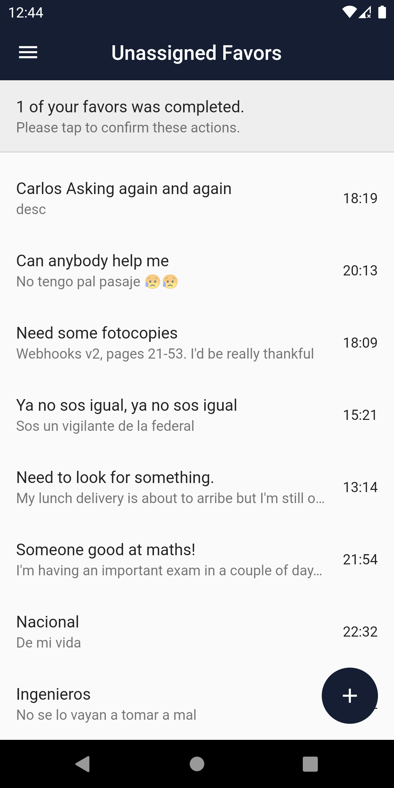
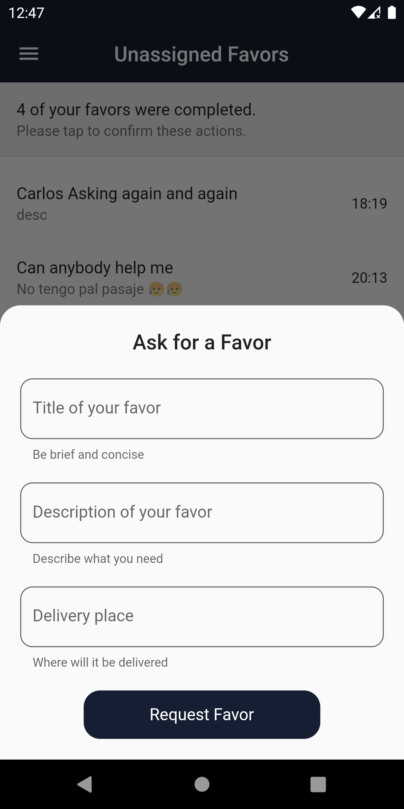
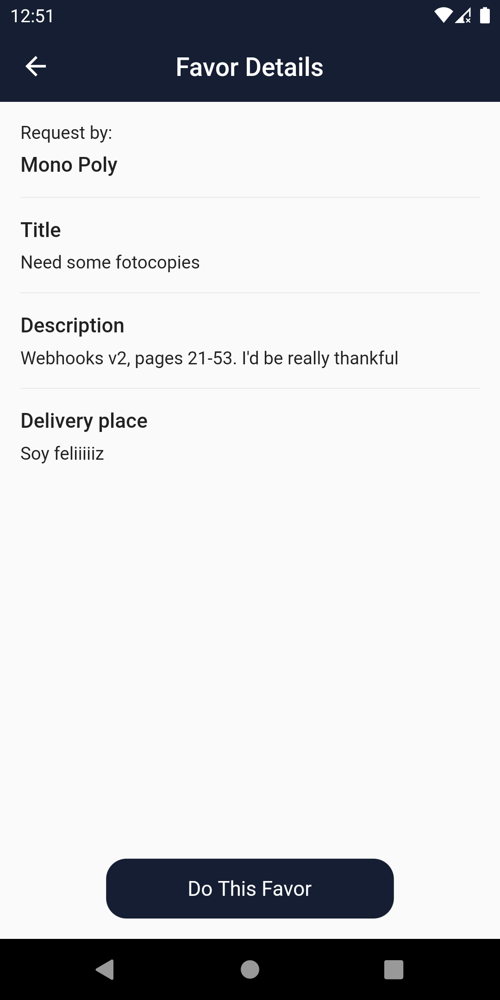
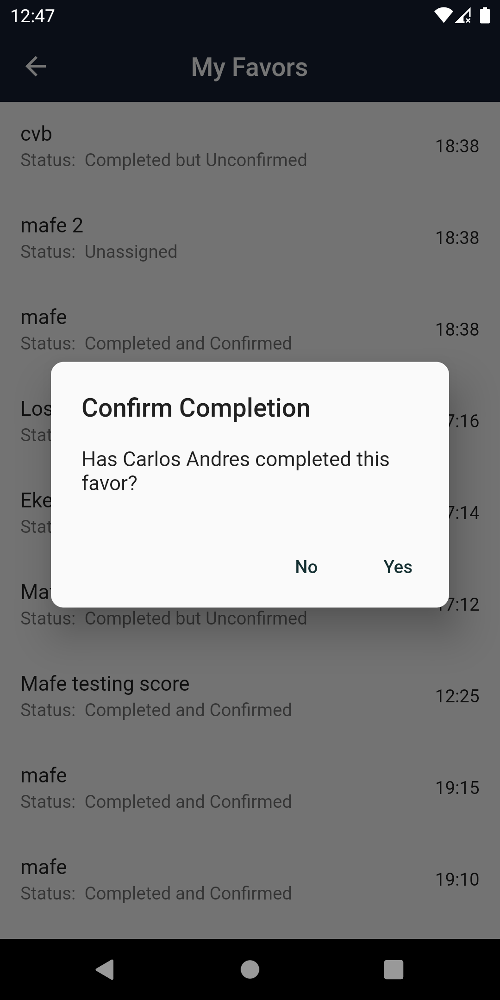

# Favors App
Mobile application (using Flutter) which allows user to Do and Request Favors.
Idea makes sense when you think of academic environments in which you may need so kind of quick help like making a copy, a queue at the restaurant, so on.

## Screenshots
 

## Contributing
Pull requests are welcome. For major changes, please open an issue first to discuss what you would like to change.

## License
[MIT](https://choosealicense.com/licenses/mit/)